Immune Response Analysis
================
Ravi Brenner, Cameron Chesbrough, Wayne Monical
2025-03-25

## Introduction

This report was originally written as part of Columbia Mailman’s Data
Science for machine learning class. A study was conducted to measure the
antibody response to a new vaccine. A variety of descriptive information
was collected alongside this data, and the project was replicated on a
new sample of participants a few months later. To better understand the
impact of demographic and clinical characteristics on antibody response,
a model can be constructed to evaluate and make predictions on future
vaccine testing. Different models may be built using the data from the
first study, compared to each other so that the best fit may be found,
and validated using the data from the second study.

## Exploratory analysis

Beginning with the first dataset, there are no missing values. The
log-transformed antibody level also appears to be normally distributed.
White participants make up 64% of the data and non-smokers make up 60%.
There is some correlation between blood pressure and age; unsurprisingly
there is also correlation between bmi, weight, and height. Antibody
response does not appear to vary substantially by demographic variables.
Females have slightly higher average antibody responses than males, but
the difference is small. The relationship between antibody response and
time appears to be nonlinear, with log antibody increasing initially and
then decreasing over time. Antibody levels also decrease with increasing
BMI.

## Model training

For all models, we used 10-fold cross validation to compute the root
mean standard error (RMSE) with the caret package in R. By ensuring the
same random split for each model, we can compare RMSE values across
models and choose the model with the lowest average training error. When
training models with variable tuning parameters, we also used cross
validation to select the tuning parameter across a range of values that
achieved the lowest error for that type of model.

All predictors were used for each model fit with log antibody as the
response variable. For the first model we fit a standard least squares
linear regression model. This model treats the relationship between the
predictors and response as strictly linear and fits a coefficient for
each predictor as well as an overall intercept to minimize the residual
sum of squares. This makes the model simple to interpret, but
potentially at the expense of prediction accuracy.

For the second model we fit an elastic net regression. This model builds
off the least squares linear regression model and adds two penalty
terms. These penalty terms regularize, or shrink, the coefficients from
the linear part of the model. One of these penalty terms comes from
ridge regression which minimizes the sum of the squared coefficients;the
other penalty term comes from lasso regression which minimizes the sum
of the absolute values of the coefficients. The lasso penalty allows
coefficients to be shrunk down all the way to zero, removing variables
from the model altogether. The elastic net procedure balances the weight
between these two penalty terms to optimize prediction accuracy. To
construct our elastic net we used a range of 21 incrementally increasing
alpha values from 0 to 1 (0, 0.05, 010…), and a range of 100
incrementally decreasing lambda values from e6 to e-10. For the third
model we fit a generalized additive model, or GAM. GAMs allow for
nonlinear relationships between predictors and response variables; they
have a similar overall structure to linear regression models. The GAM
procedure in R automatically models these linear and nonlinear
relationships and selects (via cross validation) the model that most
accurately predicts the outcome variable.

For the fourth model we fit a multivariate adaptive regression splines,
or MARS model. This type of model constructs multiple hinge functions
(or products of hinge functions), for the set of predictors in an
automated way to best predict the outcome variable. The two tuning
parameters are the degree of features and the number of terms.The
optimal combination of these tuning parameters is selected via cross
validation. To construct our MARS model we tested product degrees of 1,
2, and 3 and a range of pruning terms from 2 to 15.

## Results

The average cross-validated RMSE of the linear, elastic net, GAM, and
MARS models were 0.551, 0.551, 0.529, and 0.528 respectively. The models
were fit using cross validation to select tuning parameters where
applicable. The model with the lowest RMSE on the initial dataset was
the MARS model. When we used this model to make predictions using the
new dataset, the RMSE increased to 0.533. This model performs slightly
worse on the new out of sample data, but this value is inside the range
of cross-validated training error observed during resampling. The model
has generalized well likely because the new data and the old data were
drawn from similar populations. This model could reasonably be used for
making future predictions about antibody levels, given similar data. The
application of this model could allow researchers to predict the
expected antibody level for a patient given their demographic and
clinical measurements, which may be helpful for medical professionals
designing vaccines and administering vaccinations.

### Library Load

``` r
library(caret)
library(tidymodels)
library(vtable)
library(corrplot)
library(patchwork)
library(splines)
library(mgcv)
library(pdp)
library(earth)
library(tidyverse)
library(ggplot2)
library(glmnet)
```

### Loading data

``` r
load("../dat1.RData")
load("../dat2.RData")
```

## Exploratory Data Analysis

Variable Transformation

``` r
dat1 <- dat1 |>
  mutate(gender = factor(gender, levels = c(0,1),
                         labels = c("Female","Male")),
         race = factor(race, levels = c(1,2,3,4),
                       labels = c("White","Asian","Black","Hispanic")),
         smoking = factor(smoking, levels = c(0,1,2),
                          labels = c("Never smoked","Former smoker","Current smoker")),
         diabetes = factor(diabetes, levels = c(0,1),
                           labels = c("No","Yes")),
         hypertension = factor(hypertension, levels = c(0,1),
                               labels = c("No","Yes")),
         ) |>
  dplyr::select(-id)

dat2 <- dat2 |>
  mutate(gender = factor(gender, levels = c(0,1),
                         labels = c("Female","Male")),
         race = factor(race, levels = c(1,2,3,4),
                       labels = c("White","Asian","Black","Hispanic")),
         smoking = factor(smoking, levels = c(0,1,2),
                          labels = c("Never smoked","Former smoker","Current smoker")),
         diabetes = factor(diabetes, levels = c(0,1),
                           labels = c("No","Yes")),
         hypertension = factor(hypertension, levels = c(0,1),
                               labels = c("No","Yes")),
         ) |>
  dplyr::select(-id)
```

### Plotting

``` r
theme1 <- trellis.par.get()
theme1$plot.symbol$col = rgb(.2, .2, .2, .4)
theme1$plot.symbol$pch = 16
theme1$plot.line$col = rgb(1, 0, 0, .7)
theme1$plot.line$lwd <- 2
trellis.par.set(theme1)

featurePlot(x = dat1 |> dplyr::select(-log_antibody,
                                      -where(is.factor)),
            y = dat1$log_antibody,
            type = c("p","smooth"))
```

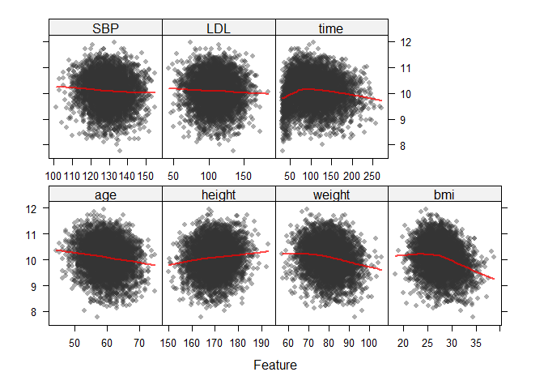<!-- -->

``` r
dat1 |> 
  dplyr::select(log_antibody,gender,race, smoking,diabetes, hypertension) |>
  pivot_longer(cols = 2:6,
               names_to = "variable",
               values_to = "value") |>
  ggplot(aes(x = value, y = log_antibody)) + 
  geom_boxplot() +
  facet_wrap(.~variable,scales = "free_x")
```

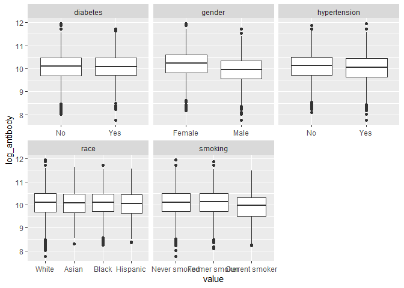<!-- -->

``` r
antibody_hist = hist(dat1$log_antibody)
```

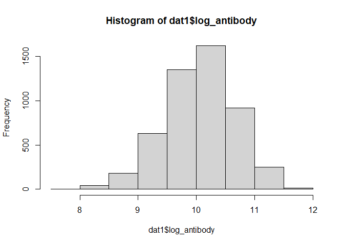<!-- -->

``` r
antibody_scatter = plot(x = dat1$time, y = dat1$log_antibody)
```

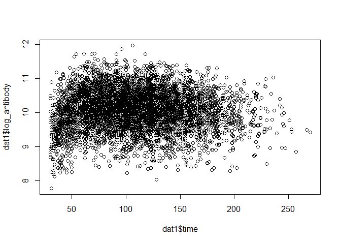<!-- -->

``` r
summ_table = sumtable(dat1, out = 'return')
continuous = dat1[c(1,5:7,10:12)]
correlations = cor(continuous)
corr_plot = corrplot(correlations)
```

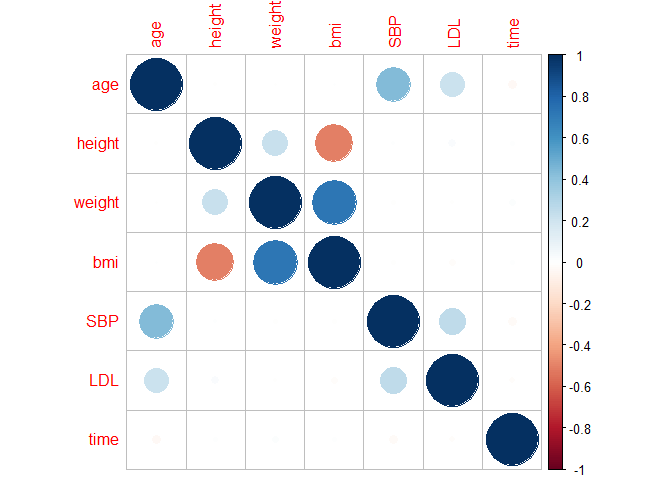<!-- -->

``` r
report_table = sumtable(dat1, out = 'kable')
report_table
```

<table>

<caption>

Summary Statistics
</caption>

<thead>

<tr>

<th style="text-align:left;">

Variable
</th>

<th style="text-align:left;">

N
</th>

<th style="text-align:left;">

Mean
</th>

<th style="text-align:left;">

Std. Dev.
</th>

<th style="text-align:left;">

Min
</th>

<th style="text-align:left;">

Pctl. 25
</th>

<th style="text-align:left;">

Pctl. 75
</th>

<th style="text-align:left;">

Max
</th>

</tr>

</thead>

<tbody>

<tr>

<td style="text-align:left;">

age
</td>

<td style="text-align:left;">

5000
</td>

<td style="text-align:left;">

60
</td>

<td style="text-align:left;">

4.5
</td>

<td style="text-align:left;">

44
</td>

<td style="text-align:left;">

57
</td>

<td style="text-align:left;">

63
</td>

<td style="text-align:left;">

75
</td>

</tr>

<tr>

<td style="text-align:left;">

gender
</td>

<td style="text-align:left;">

5000
</td>

<td style="text-align:left;">

</td>

<td style="text-align:left;">

</td>

<td style="text-align:left;">

</td>

<td style="text-align:left;">

</td>

<td style="text-align:left;">

</td>

<td style="text-align:left;">

</td>

</tr>

<tr>

<td style="text-align:left;">

… Female
</td>

<td style="text-align:left;">

2573
</td>

<td style="text-align:left;">

51%
</td>

<td style="text-align:left;">

</td>

<td style="text-align:left;">

</td>

<td style="text-align:left;">

</td>

<td style="text-align:left;">

</td>

<td style="text-align:left;">

</td>

</tr>

<tr>

<td style="text-align:left;">

… Male
</td>

<td style="text-align:left;">

2427
</td>

<td style="text-align:left;">

49%
</td>

<td style="text-align:left;">

</td>

<td style="text-align:left;">

</td>

<td style="text-align:left;">

</td>

<td style="text-align:left;">

</td>

<td style="text-align:left;">

</td>

</tr>

<tr>

<td style="text-align:left;">

race
</td>

<td style="text-align:left;">

5000
</td>

<td style="text-align:left;">

</td>

<td style="text-align:left;">

</td>

<td style="text-align:left;">

</td>

<td style="text-align:left;">

</td>

<td style="text-align:left;">

</td>

<td style="text-align:left;">

</td>

</tr>

<tr>

<td style="text-align:left;">

… White
</td>

<td style="text-align:left;">

3221
</td>

<td style="text-align:left;">

64%
</td>

<td style="text-align:left;">

</td>

<td style="text-align:left;">

</td>

<td style="text-align:left;">

</td>

<td style="text-align:left;">

</td>

<td style="text-align:left;">

</td>

</tr>

<tr>

<td style="text-align:left;">

… Asian
</td>

<td style="text-align:left;">

278
</td>

<td style="text-align:left;">

6%
</td>

<td style="text-align:left;">

</td>

<td style="text-align:left;">

</td>

<td style="text-align:left;">

</td>

<td style="text-align:left;">

</td>

<td style="text-align:left;">

</td>

</tr>

<tr>

<td style="text-align:left;">

… Black
</td>

<td style="text-align:left;">

1036
</td>

<td style="text-align:left;">

21%
</td>

<td style="text-align:left;">

</td>

<td style="text-align:left;">

</td>

<td style="text-align:left;">

</td>

<td style="text-align:left;">

</td>

<td style="text-align:left;">

</td>

</tr>

<tr>

<td style="text-align:left;">

… Hispanic
</td>

<td style="text-align:left;">

465
</td>

<td style="text-align:left;">

9%
</td>

<td style="text-align:left;">

</td>

<td style="text-align:left;">

</td>

<td style="text-align:left;">

</td>

<td style="text-align:left;">

</td>

<td style="text-align:left;">

</td>

</tr>

<tr>

<td style="text-align:left;">

smoking
</td>

<td style="text-align:left;">

5000
</td>

<td style="text-align:left;">

</td>

<td style="text-align:left;">

</td>

<td style="text-align:left;">

</td>

<td style="text-align:left;">

</td>

<td style="text-align:left;">

</td>

<td style="text-align:left;">

</td>

</tr>

<tr>

<td style="text-align:left;">

… Never smoked
</td>

<td style="text-align:left;">

3010
</td>

<td style="text-align:left;">

60%
</td>

<td style="text-align:left;">

</td>

<td style="text-align:left;">

</td>

<td style="text-align:left;">

</td>

<td style="text-align:left;">

</td>

<td style="text-align:left;">

</td>

</tr>

<tr>

<td style="text-align:left;">

… Former smoker
</td>

<td style="text-align:left;">

1504
</td>

<td style="text-align:left;">

30%
</td>

<td style="text-align:left;">

</td>

<td style="text-align:left;">

</td>

<td style="text-align:left;">

</td>

<td style="text-align:left;">

</td>

<td style="text-align:left;">

</td>

</tr>

<tr>

<td style="text-align:left;">

… Current smoker
</td>

<td style="text-align:left;">

486
</td>

<td style="text-align:left;">

10%
</td>

<td style="text-align:left;">

</td>

<td style="text-align:left;">

</td>

<td style="text-align:left;">

</td>

<td style="text-align:left;">

</td>

<td style="text-align:left;">

</td>

</tr>

<tr>

<td style="text-align:left;">

height
</td>

<td style="text-align:left;">

5000
</td>

<td style="text-align:left;">

170
</td>

<td style="text-align:left;">

5.9
</td>

<td style="text-align:left;">

150
</td>

<td style="text-align:left;">

166
</td>

<td style="text-align:left;">

174
</td>

<td style="text-align:left;">

193
</td>

</tr>

<tr>

<td style="text-align:left;">

weight
</td>

<td style="text-align:left;">

5000
</td>

<td style="text-align:left;">

80
</td>

<td style="text-align:left;">

7.1
</td>

<td style="text-align:left;">

57
</td>

<td style="text-align:left;">

75
</td>

<td style="text-align:left;">

85
</td>

<td style="text-align:left;">

106
</td>

</tr>

<tr>

<td style="text-align:left;">

bmi
</td>

<td style="text-align:left;">

5000
</td>

<td style="text-align:left;">

28
</td>

<td style="text-align:left;">

2.8
</td>

<td style="text-align:left;">

18
</td>

<td style="text-align:left;">

26
</td>

<td style="text-align:left;">

30
</td>

<td style="text-align:left;">

39
</td>

</tr>

<tr>

<td style="text-align:left;">

diabetes
</td>

<td style="text-align:left;">

5000
</td>

<td style="text-align:left;">

</td>

<td style="text-align:left;">

</td>

<td style="text-align:left;">

</td>

<td style="text-align:left;">

</td>

<td style="text-align:left;">

</td>

<td style="text-align:left;">

</td>

</tr>

<tr>

<td style="text-align:left;">

… No
</td>

<td style="text-align:left;">

4228
</td>

<td style="text-align:left;">

85%
</td>

<td style="text-align:left;">

</td>

<td style="text-align:left;">

</td>

<td style="text-align:left;">

</td>

<td style="text-align:left;">

</td>

<td style="text-align:left;">

</td>

</tr>

<tr>

<td style="text-align:left;">

… Yes
</td>

<td style="text-align:left;">

772
</td>

<td style="text-align:left;">

15%
</td>

<td style="text-align:left;">

</td>

<td style="text-align:left;">

</td>

<td style="text-align:left;">

</td>

<td style="text-align:left;">

</td>

<td style="text-align:left;">

</td>

</tr>

<tr>

<td style="text-align:left;">

hypertension
</td>

<td style="text-align:left;">

5000
</td>

<td style="text-align:left;">

</td>

<td style="text-align:left;">

</td>

<td style="text-align:left;">

</td>

<td style="text-align:left;">

</td>

<td style="text-align:left;">

</td>

<td style="text-align:left;">

</td>

</tr>

<tr>

<td style="text-align:left;">

… No
</td>

<td style="text-align:left;">

2702
</td>

<td style="text-align:left;">

54%
</td>

<td style="text-align:left;">

</td>

<td style="text-align:left;">

</td>

<td style="text-align:left;">

</td>

<td style="text-align:left;">

</td>

<td style="text-align:left;">

</td>

</tr>

<tr>

<td style="text-align:left;">

… Yes
</td>

<td style="text-align:left;">

2298
</td>

<td style="text-align:left;">

46%
</td>

<td style="text-align:left;">

</td>

<td style="text-align:left;">

</td>

<td style="text-align:left;">

</td>

<td style="text-align:left;">

</td>

<td style="text-align:left;">

</td>

</tr>

<tr>

<td style="text-align:left;">

SBP
</td>

<td style="text-align:left;">

5000
</td>

<td style="text-align:left;">

130
</td>

<td style="text-align:left;">

8
</td>

<td style="text-align:left;">

101
</td>

<td style="text-align:left;">

124
</td>

<td style="text-align:left;">

135
</td>

<td style="text-align:left;">

155
</td>

</tr>

<tr>

<td style="text-align:left;">

LDL
</td>

<td style="text-align:left;">

5000
</td>

<td style="text-align:left;">

110
</td>

<td style="text-align:left;">

20
</td>

<td style="text-align:left;">

43
</td>

<td style="text-align:left;">

96
</td>

<td style="text-align:left;">

124
</td>

<td style="text-align:left;">

185
</td>

</tr>

<tr>

<td style="text-align:left;">

time
</td>

<td style="text-align:left;">

5000
</td>

<td style="text-align:left;">

109
</td>

<td style="text-align:left;">

43
</td>

<td style="text-align:left;">

30
</td>

<td style="text-align:left;">

76
</td>

<td style="text-align:left;">

138
</td>

<td style="text-align:left;">

270
</td>

</tr>

<tr>

<td style="text-align:left;">

log_antibody
</td>

<td style="text-align:left;">

5000
</td>

<td style="text-align:left;">

10
</td>

<td style="text-align:left;">

0.6
</td>

<td style="text-align:left;">

7.8
</td>

<td style="text-align:left;">

9.7
</td>

<td style="text-align:left;">

10
</td>

<td style="text-align:left;">

12
</td>

</tr>

</tbody>

</table>

### The Second Dataset

``` r
antibody_hist = hist(dat1$log_antibody)
```

<!-- -->

``` r
antibody_hist_data2 = hist(dat2$log_antibody)
```

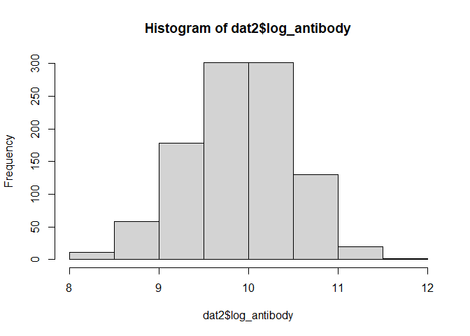<!-- -->

``` r
summ_table_data2 = sumtable(dat2, out = 'return')
```

## Model Training

Creating the design Matrix

``` r
load('../dat1.RData')

design_matrix = 
  dat1 |>
  mutate(
    race_asian = as.numeric(race == 2),
    race_black = as.numeric(race == 3),
    race_hispanic = as.numeric(race == 4),
    smoking_former = as.numeric(smoking == 1),
    smoking_current = as.numeric(smoking ==2)
  ) %>% 
  select(
    age, gender, race_asian, race_black, race_hispanic, 
    smoking_former, smoking_current, height, weight,
    bmi, diabetes, hypertension, SBP, LDL, time, 
    log_antibody
  )
```

Specify X and Y for model training

``` r
y = design_matrix$log_antibody
x = select(design_matrix, -log_antibody) %>% 
  as.matrix()
```

Specify CV Procedure

``` r
ctrl <- trainControl(method = "cv", number = 10)
```

Linear Regression

``` r
set.seed(1)
model.linear =
  train(x = x,
        y = y,
        method = "lm", 
        metric = "RMSE",
        trControl = ctrl)

hist(model.linear$resample$RMSE)
```

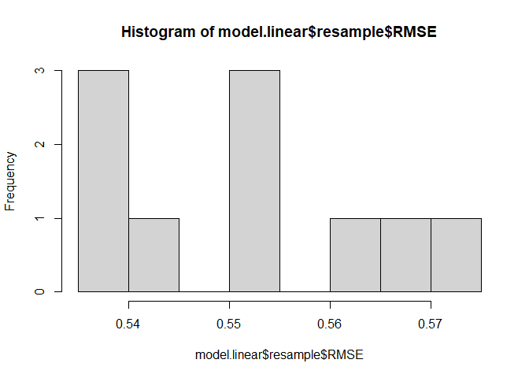<!-- -->

``` r
coef(model.linear$finalModel)
```

    ##     (Intercept)             age          gender      race_asian      race_black 
    ##   26.6751961468   -0.0205978746   -0.2974929370   -0.0060422043   -0.0075294859 
    ##   race_hispanic  smoking_former smoking_current          height          weight 
    ##   -0.0417570580    0.0219906714   -0.1934834467   -0.0821380676    0.0859034194 
    ##             bmi        diabetes    hypertension             SBP             LDL 
    ##   -0.2977934503    0.0112794933   -0.0179106155    0.0015181119   -0.0001645307 
    ##            time 
    ##   -0.0003010641

Elastic Net

``` r
set.seed(1)
model.elastic_net =
  train(x = x,
        y = y,
        method = "glmnet", 
        metric = "RMSE",
        trControl = ctrl,
        tuneGrid = expand.grid(.alpha = seq(0,1, length = 21),
                               .lambda = exp(seq(6,-10, length = 100))))
```

    ## Warning in nominalTrainWorkflow(x = x, y = y, wts = weights, info = trainInfo,
    ## : There were missing values in resampled performance measures.

``` r
hist(model.elastic_net$resample$RMSE)
```

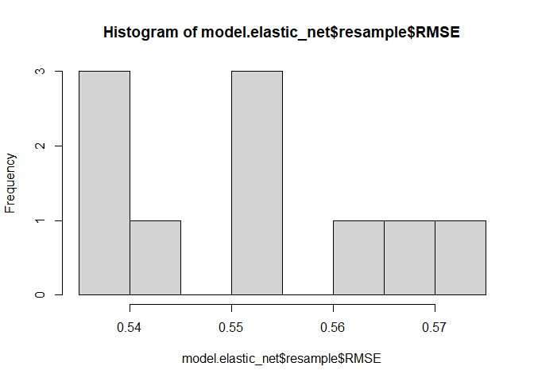<!-- -->

``` r
plot(model.elastic_net, xTrans = log)
```

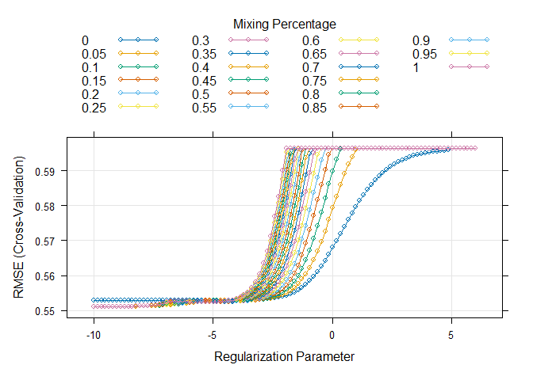<!-- -->

### GAM

``` r
set.seed(1)
model.gam =
  train(x = x,
        y = y,
        method = "gam", 
        metric = "RMSE",
        trControl = ctrl)
```

``` r
plot(model.gam)
```

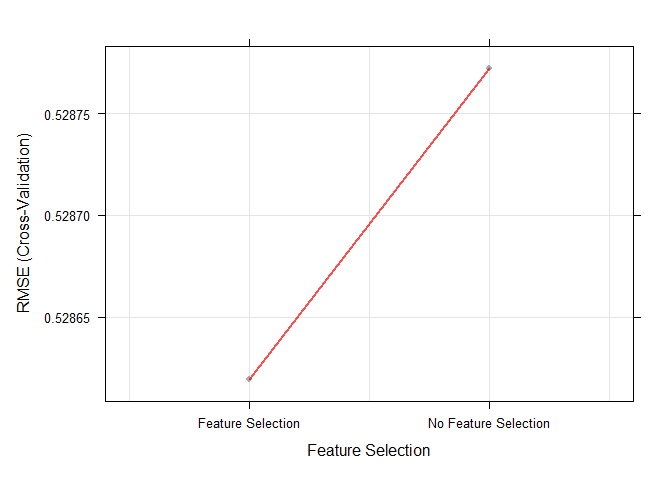<!-- -->

### MARS

``` r
mars_grid = 
  expand.grid(degree = 1:3,
              nprune = 2:15)

set.seed(1)
model.mars = 
  train(x, y,
        method = "earth",
        tuneGrid = mars_grid,
        trControl = ctrl)

ggplot(model.mars) + 
  labs('MARS Model Evaluation')
```

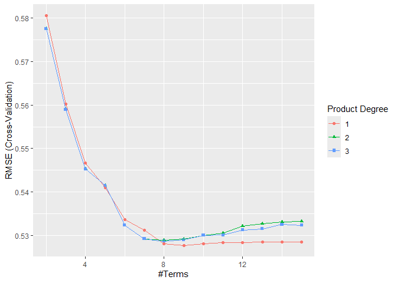<!-- -->

## Comparing Cross Validated RMSE

``` r
model.RMSE= 
  rbind(
  data.frame(
    model = 'Linear',
    RMSE = model.linear$resample$RMSE
  ),
  data.frame(
    model = 'Elastic Net',
    RMSE = model.elastic_net$resample$RMSE),
  data.frame(
    model = 'GAM',
    RMSE = model.gam$resample$RMSE
  ),
  data.frame(
    model = 'MARS',
    RMSE = model.mars$resample$RMSE
  )
)
```

``` r
model.RMSE %>% 
  group_by(model) %>% 
  summarize(mean(RMSE))
```

    ## # A tibble: 4 × 2
    ##   model       `mean(RMSE)`
    ##   <chr>              <dbl>
    ## 1 Elastic Net        0.551
    ## 2 GAM                0.529
    ## 3 Linear             0.551
    ## 4 MARS               0.528

``` r
model.RMSE |>
  ggplot(aes(x = model, y = RMSE)) +
  geom_violin()+
  stat_summary(
    fun = "mean",
               geom = "point",
               color = "red")+
  labs(title = "Model RMSE Comparison", xlab = "Model")
```

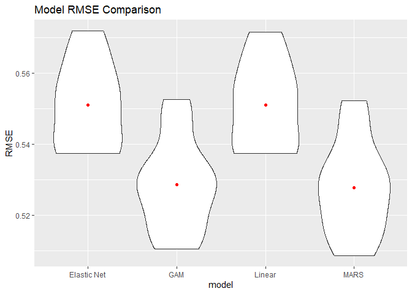<!-- -->

## Model Evaluation

Cleaning the new data set

``` r
load('../dat2.RData')

design_matrix2 = 
  dat2 |>
  mutate(
    race_asian = as.numeric(race == 2),
    race_black = as.numeric(race == 3),
    race_hispanic = as.numeric(race == 4),
    smoking_former = as.numeric(smoking == 1),
    smoking_current = as.numeric(smoking ==2)
  ) %>% 
  select(
    age, gender, race_asian, race_black, race_hispanic, 
    smoking_former, smoking_current, height, weight,
    bmi, diabetes, hypertension, SBP, LDL, time, 
    log_antibody
  )

x2 = as.matrix(dplyr::select(design_matrix2, -log_antibody))
y2 = design_matrix2$log_antibody
```

Making predictions using MARS model and get test set RMSE

``` r
pred = predict(model.mars, x2)

dat2_rmse = sqrt(mean((pred - y2)^2))

dat2_rmse
```

    ## [1] 0.5327718
